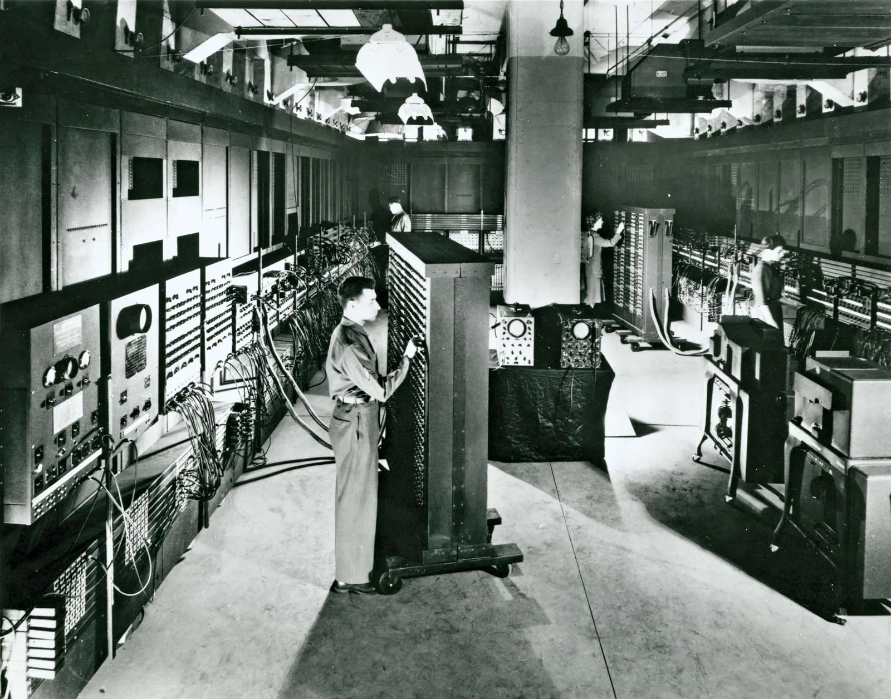

# **Introdução a Programação (em C)**
## **1: História da Computação**

---

#### Máquina de tear de Jacquard e Cartões perfurados

- 1801 - Na França, por Joseph Marie Jacquard
- Noção de instruções e automação

---

#### Ada Lovelace (10/12/1815 - 27/11/1852)

- Máquina Analítica de Babbage
- Considerada a primeira programadora da história, escreveu o que é considerado o primeiro algoritmo
- A primeira pessoa que pensou que para além da resolução de cálculos, você poderia usar os números para representar outras entidades, como letras ou notas musicais, daí a máquina poderia manipular símbolos

---
#### Máquina de Hollerith

- 
- 1889 - Herman Hollerith: Máquina de Hollerith ou Tabuladora (Emprego da eletricidade)
- Reduziu um processo de 10 anos a 2 anos
- 1896 - Tabulating Machine Company
 
---

#### Alan Turing (23/06/1912 - 07/06/1954)

- Considerado o pai da computação
- Decifrou os códigos do Enigma na segunda guerra mundial
- Provou que não existe um programa que consegue dizer pra gente se um outro programa para ou é executado pra sempre: **halting problem** (problema da parada)
- Criou o conceito da máquina de turing universal

---

#### ENIAC - Primeiro computador

- 1946 - *Electronic Numerical Integrator and Computer* (Computador e Integrador Numérico Eletrônico)
- Totalmente eletrônico (componentes de condução elétrica), de propósito geral (programável), digital (dados em valores discretos)
- Pesava umas 30 toneladas

---
#### John Von Neumann (28/12/1903 - 08/02/1957)

- Arquitetura de Von Neumann
- Computador separado em Processador e Memória
- Dados e Instruções são armazenadas na memória do computador

---
#### 1947 - Assembly (Asm)
- Um casal: Kathleen e Andrew Booth
- Assemble -> Montar
- Linguagem que pode ser lida por humanos, estando um nível acima da linguagem de máquina
- Forte correlação entre as instruções da linguagem e as instruções em linguagem de máquina de uma arquitetura
- Objetivo é simplificar as intruções lidas pelo processador
- https://godbolt.org/

---
#### Primeiras linguagens de "alto nível"

- Cada computador tinha uma linguagem de assembly **E** cada computador era diferente
- 1957 - Fortran
- 1958 - LISP
    - Linguagem funcional
- 1959 - COBOL
    - Grace Hopper
- 1964 - BASIC

---
#### Década de 70
- Linguagens de programação para sistemas (*Systems programming language*)
    - 1970 - Pascal  (Blaise Pascal)
    - 1972 - Linguagem C
- 1969 - ARPANET (*Advanced Research Projects Agency Network* -> Rede da Agência para Projetos de Pesquisa Avançada)
    - Precursora da internet
    - Protocolo TCP/IP

---
#### Década de 70
- 1971 - Unix (sistemas operacionais)
    - Criado como uma ferramenta interna dentro da *Bell Labs*
    - Conectado fortemente a linguagem C (Ken Thompson & Dennis Ritchie)
- 1972 - Smalltalk (Alan Kay)
    - Linguagem de Programação Orientada a Objetos

---
#### Década de 70
- 1974 - SQL (Structured Query Language -> Linguagem de Consulta Estruturada)
    - Usada amplamente para interagir com bancos de dados
- 1975 - Fundação da Microsoft
- 1976 - Fundação da Apple
- 1977 - Atari; Apple II

---
#### Década de 80
- 1983 - C++
    - "C com classes"
    - Apresenta várias funcionalidades a mais que C, além de todas as que C já apresenta
- 1984 - Tetris
- 1985 - NES (Nintendinho); Windows 1.0

---
#### Década de 80
- 1987 - Perl
    - Usado bastante para manipulação de texto
- Popularização dos PCs (Personal Computer -> Computador Pessoal)
    - Computador passa a ser um bem acessível, que cabia em uma mesa da sua casa

---
#### Década de 90
- Difusão da Internet
    - 1990 - HTML (HyperText Markup Language -> Linguagem de Marcação de Hipertexto)
    - 1990 - Primeiro navegador com interface gráfica: World Wide Web (Rede Mundial de Computadores)
    - 1993 - World Wide Web vai para domínio público
        - Um sistema interconectado que dá acesso a documentos ou arquivos

---
#### Década de 90
- Difusão de linguagens de script
    - Python (1991); Ruby (1993); Javascript (1995)
- 1991 - Linux
    - Sistema operacional de Código Aberto (*Open Source*) mais usado no mundo
    - Conceito de distribuição
- 1992 - OpenGL (Open Graphics Library -> Biblioteca gráfica aberta)
- 1993 - Linguagem de programação Lua (PUC-Rio)

---
#### Década de 90
- 1994 - Playstation 1
- 1995 - Java (Programação Orientada a Objetos)
- 2000 - A bolha das empresa .com (dot com bubble)
    - Mais de 500 empresas da NASDAQ quebraram

---
#### Década de 2000
- 2000 - Playstation 2
- 2005 - Xbox 360; Git
- 2006 - Playstation 3; Nintendo Wii
- 2007 - Primeiro iPhone
- 2009 - Linguagem Go

---
#### Mais recentemente
- Consolidação de Smartphones, da internet e redes sociais
- 2019 - 5G

---
#### Mais recentemente
- "Renascentismo" de linguagens de programação
    - 2012 - Elixir: Linguagem funcional (José Valim)
    - 2012 - Typescript
    - 2014 - Swift
    - 2015 - Rust
    - 2016 - Zig; Kotlin

---
#### Mais recentemente
- 2020 - Covid-19
    - EUA imprime muito dinheiro para segurar a crise econômica
    - Boom de empresas de tecnologia -> Grande oferta de emprego
    - Mercado fica sobrecarregado
- 2021/2022 - Fim da covid
    - Enxugamento das empresas de tecnologia -> Layoffs
- 2022 - Chatgpt liberado publicamente

---
#### Mais recentemente
- 2023 até hoje:
    - Boom da inteligência artificial generativa
        - Claude Sonnet, Midjourney, Deepseek, Grok ...
    - NVIDIA vira a empresa mais valorizada do mundo - (GPU: *Graphics Processing Unit* -> Unidade de Processamento Gráfico)
        - NPU: *Neural Processing Unit* -> Unidade de Processamento Neural
        - TPU: *Tensor Processing Unit* -> Unidade de Processamento de Tensor

---
# **Fin**
