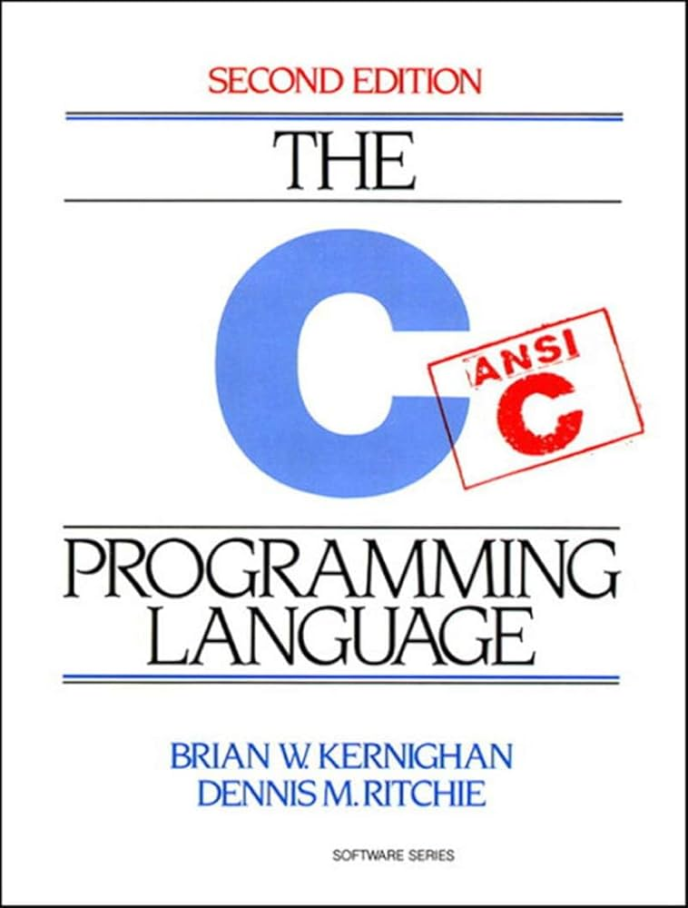

# **Introdução a Programação (em C)**
## **2: A linguagem C**

---
### **1947 - Assembly (Asm)**
- Cada computador tinha sua linguagem de Assembly
- Depende da arquitetura da CPU (Central Processing Unit -> Unidade Central de Processamento) :: O Processador

---
### **Sim! Existe a linguagem B**
- 1967 - BCPL (Basic Combined Programming Language -> Linguagem de Programação Básica Combinada)
- 1969 - Linguagem B (Ken Thompson)
- 1972 - Linguagem C (Dennis Ritchie -> Bell Labs)

---
### **C 🤝 Unix**

- Portar o Unix pra outras plataformas
- Uma linguagem **Assembly** portátil
    - Objetivo é ser 1 nível acima de Assembly
- 1973 - Unix reescrito em C
- 1978 - The C Programming Language

---
### **Por que não C++?**
- C++ é (desnecessariamente) complexo
- C++ **possui** orientação a objetos
- C++ é um superconjunto de C (mas hoje em dia é praticamente outra linguagem)
```c
std::cout << "Hello World" << std::endl;
```

---
### **Por que C?**
- C é uma linguagem:
    - Procedural
    - Estaticamente tipada
    - Imperativa
    - Gerenciamento manual de memória

---
### **Algumas coisas feitas em C**
- https://www.python.org/
- https://git-scm.com/
- https://www.raylib.com/index.html
- https://github.com/nothings/stb

---
### **Referências**
[0.1 Intro to C - A Brief History of C](https://www.youtube.com/watch?v=rmerZevE5HI)
[Ling C M00E01 História](https://www.youtube.com/watch?v=5KRdfsDN9lQ)

---
# **Fin**
