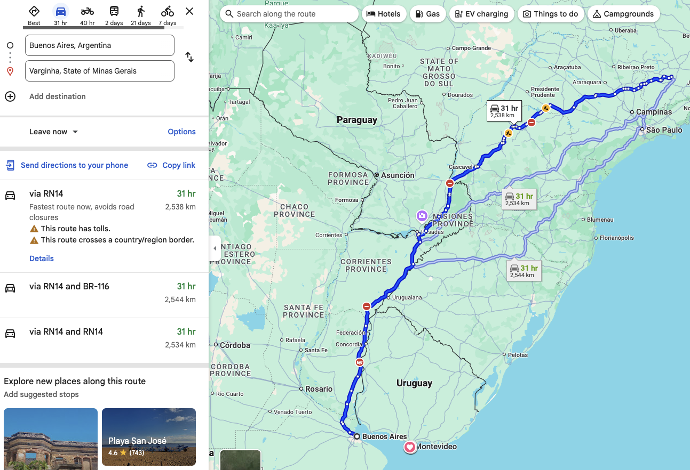
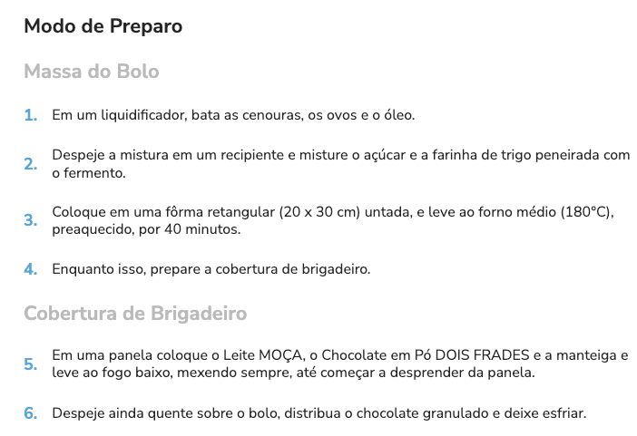

# **Introdução a Programação (em C)**
## **3: O que é um algoritmo**

---
### **Algoritmos**


---
### **Algoritmos**

"X é investigado na França por suposto viés em algoritmo, diz rádio."
via [InfoMoney](https://www.infomoney.com.br/business/x-e-investigado-na-franca-por-suposto-vies-em-algoritmo-diz-radio/)

---
### **Algoritmos**
#### Definição:
"Um algoritmo é uma sequência finita de ações executáveis que visam obter uma solução para um determinado tipo de problema."
via [Wikipedia](https://pt.wikipedia.org/wiki/Algoritmo#cite_note-1)

---
### **Algoritmos**


---
### **Algoritmos**
```c
// Calculate linear interpolation between two vectors
RMAPI Vector2 Vector2Lerp(Vector2 v1, Vector2 v2, float amount)
{
    Vector2 result = { 0 };

    result.x = v1.x + amount*(v2.x - v1.x);
    result.y = v1.y + amount*(v2.y - v1.y);

    return result;
}
```
via [Raylib](https://github.com/raysan5/raylib/blob/a1de60f3ba253ce59b2e6fa5cdb69c15eaadc1cb/src/raymath.h#L422C1-L431C2)

---

### **Fin**
